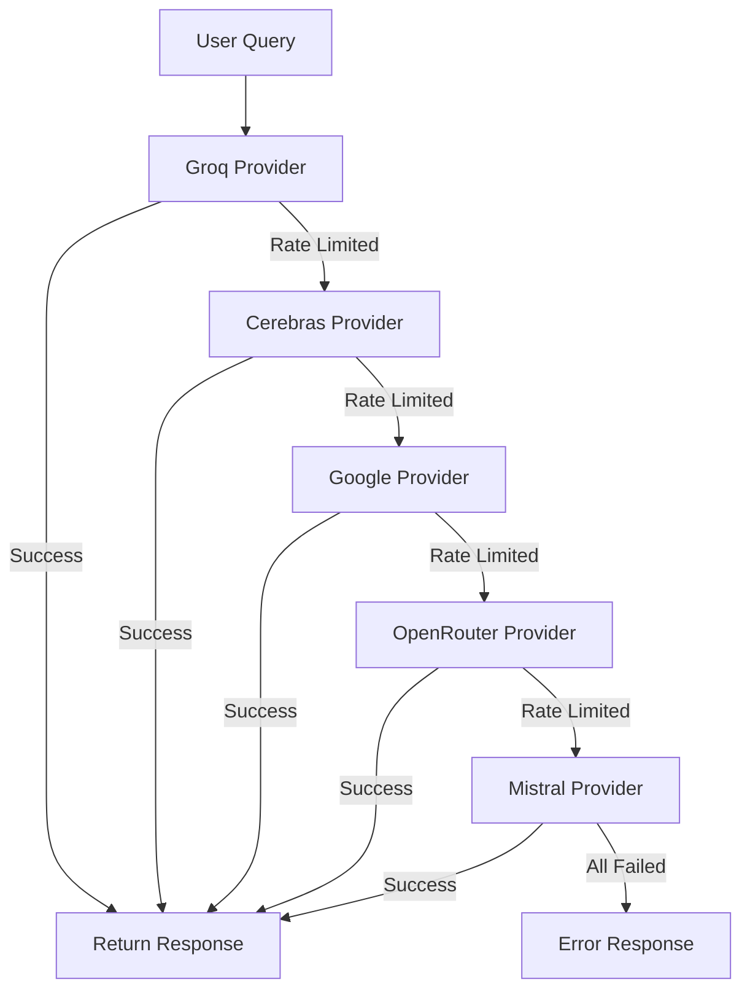

# YamiBot - AI Discord Bot with Multi-Provider Fallback


YamiBot is a production-ready AI Discord bot that leverages multiple AI providers with automatic fallback capability. When the primary provider is rate-limited or unavailable, YamiBot automatically falls back to the next available provider in the priority chain.

## Features

✅ **Multi-Provider AI Access** - 5 different AI providers with automatic fallback
✅ **Smart Rate Limiting** - Tracks and respects each provider's quotas
✅ **Caching System** - Reduces duplicate API calls and improves response times
✅ **Comprehensive Logging** - Detailed logs for debugging and monitoring
✅ **Docker Support** - Easy containerization for deployment
✅ **Koyeb Cloud Ready** - Optimized for serverless deployment
✅ **Discord Slash Commands** - Modern Discord command interface

## AI Providers (in fallback order)

1. **Groq (Primary)** - `llama-3.1-8b` - 14,400 requests/day
2. **Cerebras (Backup 1)** - `llama-3.3-70b` - 14,400 requests/day
3. **Google (Backup 2)** - `gemini-1.5-flash` - 1,000 requests/day
4. **OpenRouter (Backup 3)** - Flexible model routing
5. **Mistral (Final)** - `mistral-small` - 1 request/second limit

## Quick Start

### Prerequisites

- Python 3.11+
- Docker (for containerized deployment)
- Discord Bot Token
- API keys for all providers

### Installation

```bash
# Clone the repository
git clone https://github.com/your-username/YamiBot.git
cd YamiBot

# Copy environment file
cp .env.example .env

# Edit .env and add your API keys
nano .env

# Install dependencies
pip install -r requirements.txt
```

### Running Locally

```bash
# Start the bot
python -m src.bot

# Or use the main entry point
python main.py
```

### Running with Docker

```bash
# Build the Docker image
docker-compose -f deployment/docker-compose.yml build

# Start the bot
docker-compose -f deployment/docker-compose.yml up
```

## Discord Commands

### `/ask <question>`
Ask the AI a question. The bot will automatically use the best available provider.

**Example:**
```
/ask What is the capital of France?
```

### `/status`
Check the current status of all AI providers, including:
- Provider availability
- Rate limit status
- Remaining quotas
- Last used provider

**Example:**
```
/status
```

### `/providers`
List all available AI providers with their models and limits.

**Example:**
```
/providers
```

## Project Structure

```
YamiBot/
├── src/
│   ├── bot.py                  # Main bot entry point
│   ├── fallback_manager.py     # Provider fallback orchestration
│   ├── rate_limiter.py         # Rate limit tracking
│   ├── providers/              # AI provider implementations
│   ├── commands/               # Discord command handlers
│   └── utils/                  # Utility modules
├── deployment/                # Deployment configuration
├── .github/workflows/         # CI/CD pipelines
├── requirements.txt           # Python dependencies
├── .env.example               # Environment configuration template
└── README.md                  # This file
```

## Configuration

### Environment Variables

Copy `.env.example` to `.env` and fill in your API keys:

```env
# Required API Keys
DISCORD_TOKEN=your_discord_bot_token
GROQ_API_KEY=your_groq_api_key
CEREBRAS_API_KEY=your_cerebras_api_key
GOOGLE_AI_API_KEY=your_google_ai_api_key
OPENROUTER_API_KEY=your_openrouter_api_key
MISTRAL_API_KEY=your_mistral_api_key

# Optional Settings
BOT_PREFIX=!
SYNC_COMMANDS=true
DEBUG_MODE=false
```

### Getting API Keys

1. **Discord Token**: [Discord Developer Portal](https://discord.com/developers/applications)
2. **Groq API Key**: [Groq Console](https://console.groq.com/keys)
3. **Cerebras API Key**: [Cerebras AI](https://www.cerebras.ai/api-keys)
4. **Google AI Key**: [Google AI Studio](https://makersuite.google.com/app/apikey)
5. **OpenRouter Key**: [OpenRouter](https://openrouter.ai/keys)
6. **Mistral API Key**: [Mistral Console](https://console.mistral.ai/api-keys)

## Deployment

### Koyeb Cloud Deployment

YamiBot is optimized for deployment on [Koyeb](https://www.koyeb.com/), a serverless platform:

1. **Follow the deployment guide**: [deployment/koyeb-deploy.md](deployment/koyeb-deploy.md)
2. **Set up environment variables** in Koyeb dashboard
3. **Deploy and monitor** your bot

### Other Deployment Options

- **Heroku**: Use the Dockerfile with Heroku container support
- **AWS ECS**: Deploy the Docker container to ECS
- **Google Cloud Run**: Deploy the container to Cloud Run
- **Self-hosted**: Run on any server with Docker support

## Development

### Setting Up Development Environment

```bash
# Create virtual environment
python -m venv venv
source venv/bin/activate  # Linux/Mac
# venv\Scripts\activate  # Windows

# Install development dependencies
pip install -r requirements.txt
# pip install black isort mypy pytest  # For development tools
```

### Running Tests

```bash
# Run tests (when implemented)
pytest tests/

# Run linter
black src/
isort src/

# Run type checker
mypy src/
```

### Adding New Providers

To add a new AI provider:

1. Create a new file in `src/providers/` following the pattern
2. Implement the `BaseProvider` interface
3. Add the provider to the priority list in `fallback_manager.py`
4. Update the rate limiter with the provider's limits
5. Add the provider to the status and providers commands

## Architecture

### Fallback System



### Rate Limiting

The bot tracks usage for each provider:
- **Groq**: 14,400 requests/day
- **Cerebras**: 14,400 requests/day  
- **Google**: 1,000 requests/day
- **Mistral**: 1 request/second

### Caching

- **TTL-based caching**: Responses cached for 1 hour
- **LRU eviction**: Least recently used items removed when cache is full
- **Cache hits/misses**: Tracked for performance monitoring

## Monitoring and Logging

### Logs

Logs are stored in the `logs/` directory with the format:
- `yamibot_YYYY-MM-DD.log` - Daily log files
- Console output with color coding

### Log Levels

- **INFO**: General operational messages
- **WARNING**: Potential issues or rate limit warnings
- **ERROR**: Failed API calls or command errors
- **DEBUG**: Detailed debugging information (when DEBUG_MODE=true)

## Troubleshooting

### Common Issues

**Bot doesn't start:**
- Check that all API keys are correctly configured
- Verify your Discord token is valid
- Check the logs for specific error messages

**All providers unavailable:**
- Check that you haven't exceeded rate limits
- Verify all API keys are correct
- Test each provider individually

**Slow responses:**
- Check network connectivity
- Verify provider API status
- Consider enabling caching

**Command errors:**
- Ensure bot has proper permissions in your server
- Check that commands are synced (`SYNC_COMMANDS=true`)
- Verify bot intents are configured correctly

## Contributing

Contributions are welcome! Please follow these guidelines:

1. **Fork the repository**
2. **Create a feature branch**: `git checkout -b feature/your-feature`
3. **Commit your changes**: `git commit -m 'Add some feature'`
4. **Push to the branch**: `git push origin feature/your-feature`
5. **Open a pull request**

### Code Style

- Follow PEP 8 guidelines
- Use type hints
- Write docstrings for all public methods
- Keep functions small and focused

## License

This project is licensed under the MIT License. See the [LICENSE](LICENSE) file for details.

## Support

For issues, questions, or feature requests:
- Open an issue on GitHub
- Check the documentation
- Review the logs for error details

## Roadmap

Future enhancements planned:
- ✅ Multi-provider fallback system
- ✅ Rate limiting and quota tracking
- ✅ Docker containerization
- ✅ Koyeb deployment support
- 🚀 Advanced caching strategies
- 🚀 Provider health monitoring
- 🚀 Custom provider selection
- 🚀 Response quality scoring
- 🚀 Multi-language support

## Acknowledgements

- Discord.py for the excellent Discord bot framework
- All AI providers for their powerful APIs
- Koyeb for the serverless deployment platform
- Open source community for inspiration and support

---

**YamiBot** - Your intelligent Discord companion with reliable AI access! 🤖💬